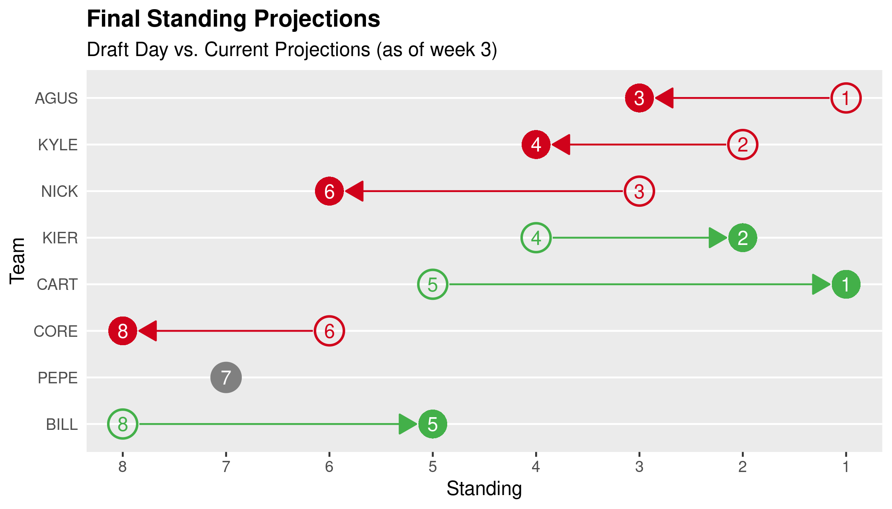

<!-- README.md is generated from README.Rmd. Please edit that file -->

# ffplot

<!-- badges: start -->

[](https://www.tidyverse.org/lifecycle/#experimental)
[](https://CRAN.R-project.org/package=ffplot)
 [](https://github.com/kiernann/ffplot/actions)
[](https://codecov.io/gh/kiernann/ffplot?branch=master)
<!-- badges: end -->

The goal of ffplot is to visualize fantasy football data from ESPN and
[fflr](https://github.com/kiernann/fflr) using
[ggplot2](github.com/tidyverse/ggplot2).

## Installation

You can install the development version of ffplot from
[GitHub](https://github.com/kiernann/ffplot) with:

``` r
# install.packages("remotes")
remotes::install_github("kiernann/ffplot")
```

## Usage

All ffplot functions take data frames from the
[fflr](https://github.com/kiernann/fflr) package.

``` r
library(fflr)
library(ffplot)
x <- league_standings(252353)
standings_change(x)
```



<!-- refs: start -->

<!-- refs: end -->
